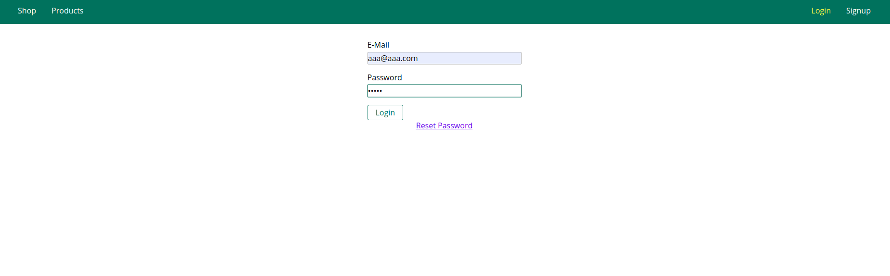
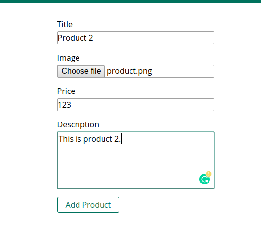
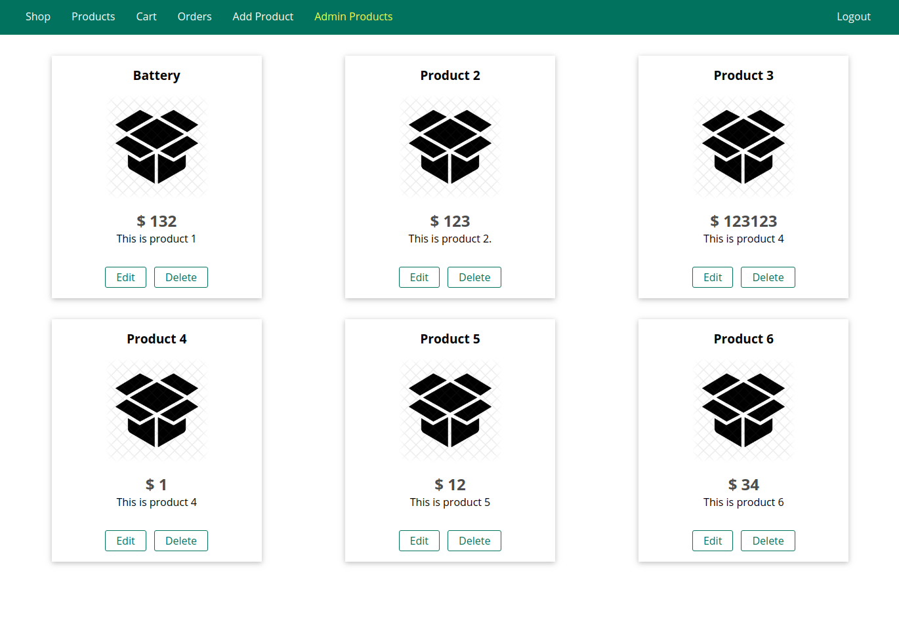
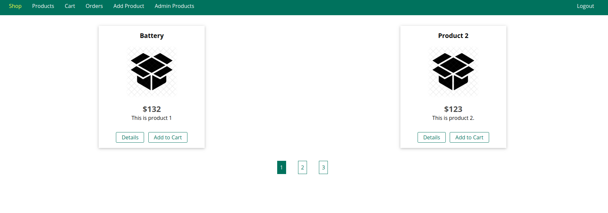
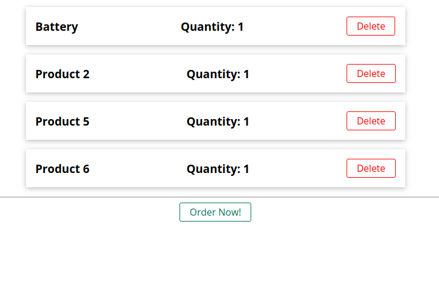
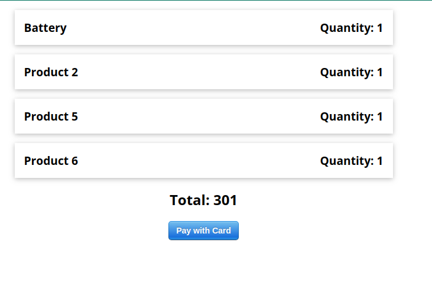

# Shopping website
This is a shopping website where different user and owner can purchase and add products and order a product.

# Functionality
- add products after login or signup your account.
- Various users can add to cart and then can order products.

# DEMO


---


---


---


---


---


---

# Techs used
- Nodejs
- HTML/CSS
- multer
- MongoDB
- Expressjs

# Usage
```bash
npm install
npm start
```